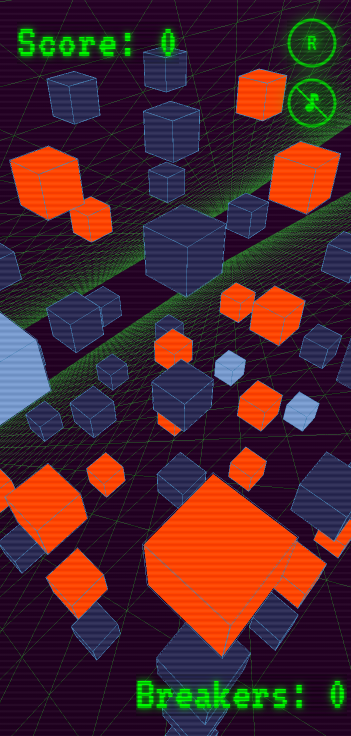

# 🎮 NodeBreaker

A 3D browser-based puzzle game where you strategically link nodes in a node network in cyberspace to win. Link all nodes while managing your limited "breaker" power-ups - but be careful not to get stuck. Also, avoid getting traced after you break into your first red data node. The game keeps track of your high score.

## 🌐 Live demo
A live version can be found [here](https://sage-snickerdoodle-468d70.netlify.app/).
NOTE: Netlify puts dormient sites to sleep after a certain period of inactivity, if you get an error on page load wait a few seconds and try reloading the page in the browser.

# 🚦 Deploy status

## 🎯 Game Rules

- Connect nodes (cubes) by tapping them to create links
- **Red nodes** are data nodes - you need breaker power-ups to link to them
- **Light blue nodes** give you breaker power-ups - use them wisely as they're limited
- Link all linkable nodes to win
- Tap and hold the (R) button to reset the game at any time
- Tap the music button to play/pause music

## 🛠️ Technologies Used

- **Three.js** - For 3D graphics rendering + glitch, scanlines postprocessing effects
- **OrbitControls** - Camera control system allowing orbital movement
- **Google Fonts** - Typography
- The entire game logic/architecture is developed using vanilla JavaScript

## 🎯 Technical Features

- Essentially an implementation of a [hamiltonian path problem](https://en.wikipedia.org/wiki/Hamiltonian_path_problem) puzzle in a 3D environment
- Implements view routing, services, event bus, game state, game config
- Uses a graph data structure for efficient cube and node network modeling
- Implements BFS (Breadth-First Search) algorithm to ensure game solvability by verifying paths between non-breakable nodes
- Strategic random placement of breakable nodes and breaker power-ups maintains game challenge
- Interactive 3D environment with orbital camera controls
- Optimized for both desktop and mobile devices
- The game keeps track of your high score in your browser's local storage

## 💡 Inspiration
Inspired by all those hacking minigames found in videogames such as DeusEx, Cyberpunk, Watch Dogs, System Shock, etc.

## ⚡ System Requirements

- The game is entirely browser-based
- A browser with WebGL2 support is required (like Chrome or Edge)
- JavaScript must be enabled

## 🎮 Controls

- **Tap/Click**: Select and link nodes
- **Tap and Hold R button**: Reset game
- **Click&drag/Touch&drag**: Orbit camera around the node network
- **Pinch/Mouse wheel**: Zoom in/out

## 📝 License
This project is licensed under the [MIT License](https://github.com/dividedby-0/game-nodebreaker/blob/main/LICENSE).
Background music from [Pixabay](https://pixabay.com/it/music/synthwave-dark-synthwave-starlit-dreams-251686/). Sound effects from Zapsplat.

## 🤝 Contributing

While this is primarily a personal project, bug reports and feature suggestions are welcome in the issues section.

## 🌟 Future Plans

- [ ] Add difficulty levels
- [ ] Add more puzzle variations